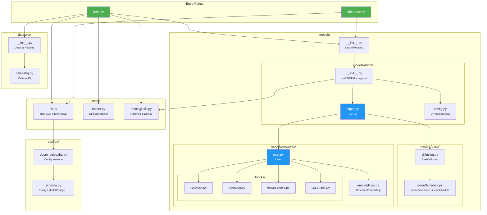
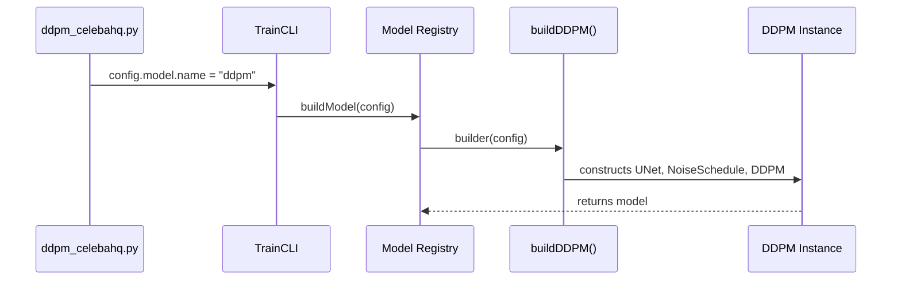

# High-Level Overview

## Design Philosophy

This codebase follows three core principles:

1. **Paper-Faithful**: Each model is implemented as close to the original paper as possible, with comments referencing the relevant equations.
2. **Modular & Registry-Driven**: Models, datasets, optimizers, and schedulers are registered in centralized registries and loaded dynamically via configuration — no hardcoded wiring in the training scripts.
3. **Config-Driven**: The entire training pipeline is controlled through Python configuration files using typed dataclasses, meaning no scattered magic numbers.

---

## Module Dependency Graph



---

## Registry Pattern

The codebase uses a **registry pattern** to decouple model/dataset definitions from the training infrastructure. This means the training script doesn't need to know about any specific model — it just asks the registry.

### Model Registry



**How registration works:**

```python
# In models/ddpm/__init__.py
@registerModel("ddpm", builder=buildDDPM)
class DDPM(BaseDiffusion):
    ...
```

This pattern lets you add a new model by:

1. Creating a new package under `models/`
2. Implementing the model class and builder
3. Registering it with `@registerModel("name", builder=myBuilder)`

The training script requires **zero changes**.

### Dataset Registry

The same pattern is used for datasets:

```python
# In datasets/celebahq.py
@registerDataset('celebahq')
class CelebAHQ(Dataset):
    ...
```

---

## Directory Structure

```
.
├── train.py                    # Training entry point
├── inference.py                # Inference entry point
├── configs/
│   ├── schema.py               # Typed dataclass config schema
│   └── ddpm_celebahq.py        # DDPM + CelebA-HQ configuration
├── models/
│   ├── __init__.py             # Model registry (registerModel, buildModel)
│   ├── base/
│   │   ├── diffusion.py        # BaseDiffusion (abstract, shared coefficients)
│   │   └── noiseSchedule.py    # NoiseSchedule ABC + LinearSchedule
│   ├── ddpm/
│   │   ├── __init__.py         # DDPM factory (buildDDPM) + registration
│   │   ├── ddpm.py             # DDPM class (forward + sample)
│   │   └── config.py           # U-Net architecture definition (block lists)
│   └── networks/
│       ├── unet.py             # UNet class (builds from block lists)
│       ├── embeddings.py       # Sinusoidal timestep embedding
│       └── blocks/
│           ├── resblock.py     # ResBlock (GroupNorm + Conv + time injection)
│           ├── attention.py    # Multi-head self-attention
│           ├── downsample.py   # Strided convolution downsampling
│           └── upsample.py     # Nearest-neighbor + conv upsampling
├── datasets/
│   ├── __init__.py             # Dataset registry
│   └── celebahq.py            # CelebA-HQ wrapper with auto-download
├── tools/
│   ├── cli.py                  # TrainCLI and InferenceCLI (Rich-powered)
│   ├── trainer.py              # DiffusionTrainer (training loop + logging)
│   └── trainingUtils.py        # Factory functions: optimizer, loss, scheduler, etc.
└── utils/
    └── modelVisualization.py   # Model visualization utilities
```
