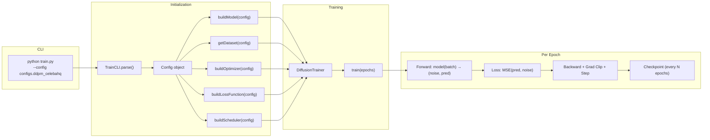

# Training Pipeline

This page documents the end-to-end training flow, from command-line invocation to a trained model checkpoint.

---

## Pipeline Overview



---

## 1. CLI Parsing

The `TrainCLI` class (in `tools/cli.py`) handles argument parsing with Rich-formatted help messages.

```bash
python train.py --config configs.ddpm_celebahq [--printConfig] [-h]
```

| Argument | Description |
|:---------|:------------|
| `--config MODULE` | Python module path to the config file (e.g. `configs.ddpm_celebahq`) |
| `--printConfig` | Print the loaded configuration and exit |
| `-h, --help` | Show the Rich-formatted help panel |

The config module is loaded dynamically via `importlib.import_module()` and must contain a `config` variable of type `Config`.

---

## 2. Model & Component Construction

All components are built through **factory functions** — no hardcoded constructors:

```python
# Model (via registry)
model = buildModel(config)                # → looks up "ddpm" → calls buildDDPM(config)

# Dataset (via registry)  
DatasetClass = getDataset(config.dataset.name)  # → looks up "celebahq" → CelebAHQ

# Optimizer, Loss, Scheduler (via factory maps)
optimizer = buildOptimizer("AdamW", model.parameters(), lr=1e-4)
lossFunction = buildLossFunction("MSE")
scheduler = buildScheduler("cosine", optimizer, T_max=100)
```

### Available Options

=== "Optimizers"
    | Name | PyTorch Class |
    |:-----|:-------------|
    | `adam` | `torch.optim.Adam` |
    | `adamw` | `torch.optim.AdamW` |
    | `sgd` | `torch.optim.SGD` |
    | `rmsprop` | `torch.optim.RMSprop` |

=== "Loss Functions"
    | Name | PyTorch Class |
    |:-----|:-------------|
    | `mse` | `nn.MSELoss` |
    | `l1` | `nn.L1Loss` |
    | `huber` | `nn.HuberLoss` |
    | `smooth_l1` | `nn.SmoothL1Loss` |

=== "Schedulers"
    | Name | PyTorch Class |
    |:-----|:-------------|
    | `cosine` | `CosineAnnealingLR` |
    | `step` | `StepLR` |
    | `exponential` | `ExponentialLR` |
    | `linear` | `LinearLR` |

=== "AMP Types"
    | Name | dtype |
    |:-----|:------|
    | `fp16` / `float16` / `half` | `torch.float16` |
    | `bf16` / `bfloat16` | `torch.bfloat16` |
    | `none` / `""` | Disabled |

---

## 3. The Training Loop

The `DiffusionTrainer` class manages the full training lifecycle.

### Initialization

When constructed, the trainer:

1. Moves the model to the selected device (CUDA → MPS → CPU)
2. Creates the log directory under `logs/{ModelName}/{timestamp}/`
3. Attaches a file logger (plain-text) alongside the Rich console logger
4. Resumes from a checkpoint if `checkpointPathRestart` is provided

### Per-Epoch Flow

```python
for epoch in range(startEpoch, epochs + 1):
    model.train()
    optimizer.zero_grad()

    for i, batch in enumerate(dataloader):
        # Forward pass (with optional AMP)
        with torch.autocast(device_type, dtype=amp):
            target, prediction = model(batch)       # DDPM: (noise, predicted_noise)
            loss = lossFunction(prediction, target)
            loss = loss / gradientAccumulationSteps  # Scale for accumulation

        # Backward pass
        loss.backward()  # (or scaler.scale(loss).backward() for fp16)

        # Optimization step (every N accumulation steps)
        if (i + 1) % gradientAccumulationSteps == 0:
            clip_grad_norm_(model.parameters(), maxGradNorm)
            optimizer.step()
            optimizer.zero_grad()
            scheduler.step()  # if present

    # Save checkpoint
    if epoch % checkpointSavingFrequency == 0:
        save_checkpoint(epoch, loss)
```

### Key Features

| Feature | Config Field | Description |
|:--------|:-------------|:------------|
| **Gradient Accumulation** | `gradientAccumulationSteps` | Simulates larger batch sizes by accumulating gradients over multiple forward passes |
| **Gradient Clipping** | `maxGradNorm` | Clips gradient norm to prevent exploding gradients (default: 10.0) |
| **Mixed Precision (AMP)** | `ampType` | Uses `torch.autocast` + `GradScaler` for fp16 training |
| **Checkpoint Rotation** | `maxNumCheckpoints` | Keeps only the N most recent checkpoints to save disk space |
| **Auto-Resume** | `checkpointPathRestart` | Restores model, optimizer, scaler, and scheduler state |

---

## 4. Logging

The trainer uses a dual-logging system:

| Output | Format | Location |
|:-------|:-------|:---------|
| **Console** | Rich-formatted with colors and markup | Terminal (stdout) |
| **File** | Plain text (Rich markup stripped) | `logs/{Model}/{timestamp}/training.log` |

Each log line during training includes:

```
[TRAIN] Epoch: 5/500 | Batch: 32/1000 | ETA: (0:02:15) [12:30:00] | LR: 0.000100 | Loss: 0.045123 | GradNorm: 1.2345
```

At the start of training, the full model architecture and training configuration are printed in Rich `Panel` boxes.

---

## 5. Checkpointing

### What's Saved

Each checkpoint (`.pth`) contains:

```python
{
    "epoch": int,
    "model_state_dict": OrderedDict,
    "optimizer_state_dict": OrderedDict,
    "scaler_state_dict": OrderedDict | None,     # If using fp16
    "scheduler_state_dict": OrderedDict | None,   # If using a scheduler
    "loss": float
}
```

### Checkpoint Rotation

To avoid filling the disk, only the `maxNumCheckpoints` most recent checkpoints are kept. Older checkpoints are automatically deleted.

### Resuming Training

```bash
python train.py --config configs.ddpm_celebahq
```

Set `checkpointPathRestart` in your config to point to a `.pth` file:

```python
training = TrainingConfig(
    checkpointPathRestart='logs/DDPM/01-01-2026_(12-00-00)/Epoch_100.pth',
    # ... other fields
)
```

The trainer will restore all state and continue from `epoch + 1`.

---

## 6. Inference

Inference is handled by a separate script with its own CLI:

```bash
python inference.py \
    --config configs.ddpm_celebahq \
    --checkpoint /path/to/Epoch_100.pth \
    --output-dir ./generated \
    --num-images 4 \
    --image-size 256
```

| Argument | Default | Description |
|:---------|:--------|:------------|
| `--config` | — | Config module path |
| `--checkpoint` | — | Path to trained checkpoint |
| `--outputDir` | `.` | Where to save generated images |
| `--numImages` | 1 | Number of images to generate |
| `--imageSize` | 256 | Output size (int or `W,H` tuple) |

The inference script:

1. Builds the model from config (same architecture)
2. Loads the checkpoint weights
3. Calls `model.sample()` to run the reverse diffusion process
4. Saves each generated image as a PNG
