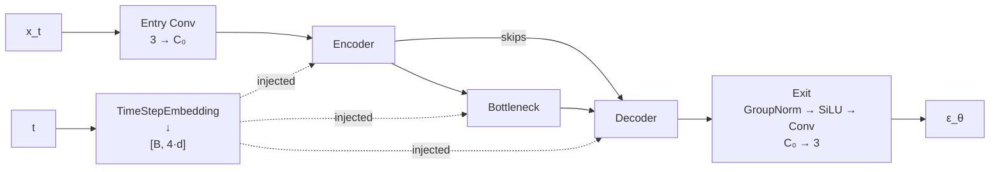

# U-Net Architecture

The U-Net is the neural network backbone used by DDPM to predict noise. It follows an encoder-bottleneck-decoder structure with **skip connections** between the encoder and decoder.

!!! tip "Related"
    For the mathematical role of the U-Net in the diffusion process, see the [DDPM Paper Explanation](../papers/ddpm.md#7-architecture-the-u-net).

---

## Overview

The U-Net receives two inputs:

1. **Noisy image** \( \mathbf{x}_t \) — shape `[B, 3, H, W]`
2. **Timestep** \( t \) — shape `[B]`

And outputs the predicted noise \( \mathbf{\epsilon}_\theta(\mathbf{x}_t, t) \) — shape `[B, 3, H, W]`.



---

## Building Blocks

The U-Net is composed of four types of blocks. Each is a self-contained `nn.Module`:

### ResBlock

The core feature extraction unit. Applies two convolutions with GroupNorm and SiLU activation. The **timestep embedding is injected between the two convolutions** via addition.

```
Input x ──→ GroupNorm → SiLU → Conv1 ──→ (+) ──→ GroupNorm → SiLU → Dropout → Conv2 ──→ (+) ──→ Output
                                           ↑                                               ↑
                                      time_proj(t)                                     reshape(x)
```

| Parameter | Type | Description |
|:----------|:-----|:------------|
| `inChannels` | `int` | Input channel count |
| `outChannels` | `int` | Output channel count |
| `dTimeEmbedding` | `int` | Timestep embedding dimension (auto-set from config) |
| `numGroups` | `int` | Groups for GroupNorm (default: 32) |
| `dropout` | `float` | Dropout probability (default: 0.1) |

!!! info "Channel mismatch"
    When `inChannels ≠ outChannels`, a 1×1 convolution is used as a learnable shortcut for the residual connection. Otherwise, an identity mapping is used.

---

### MultiHeadAttentionBlock

Spatial self-attention over feature map positions. Each spatial location `(h, w)` attends to every other location in the feature map.

```
Input x ──→ GroupNorm → Q,K,V projections → Multi-Head Attention → Output Projection ──→ (+) ──→ Output
  ↑                                                                                         ↑
  └─────────────────────────────── residual connection ─────────────────────────────────────┘
```

| Parameter | Type | Description |
|:----------|:-----|:------------|
| `numHeads` | `int` | Number of attention heads |
| `inChannels` | `int` | Input channel count (auto-inferred in UNet) |
| `numGroups` | `int` | Groups for GroupNorm (default: 32) |
| `zeroInit` | `bool` | Zero-initialize output projection (default: True) |

!!! info "Zero Initialization Trick"
    The output projection weights are initialized to zero so that the attention block initially acts as an **identity function**. This stabilizes early training by preserving the variance flow through the network.

!!! info "Where is attention applied?"
    In the default DDPM configuration, attention is applied only at 16×16 resolution (Level 4 of the encoder/decoder). Adding attention at higher resolutions would be very expensive due to the \( O(L^2) \) cost where \( L = H \times W \).

---

### DownSampleBlock

Reduces spatial resolution using a strided convolution.

| Parameter | Type | Default | Description |
|:----------|:-----|:--------|:------------|
| `inChannels` | `int` | — | Input channels |
| `outChannels` | `int` | — | Output channels |
| `kernelSize` | `int` | 3 | Convolution kernel size |
| `stride` | `int` | 2 | Stride (controls downsampling factor) |
| `padding` | `int` | 1 | Padding |

**Output spatial size:**  
\( H_\text{out} = \lfloor (H + 2P - K) / S + 1 \rfloor \)

With the defaults (K=3, S=2, P=1), the resolution is halved: `H/2 × W/2`.

---

### UpSampleBlock

Increases spatial resolution using **nearest-neighbor interpolation** followed by a convolution.

| Parameter | Type | Default | Description |
|:----------|:-----|:--------|:------------|
| `inChannels` | `int` | — | Input channels |
| `outChannels` | `int` | — | Output channels |
| `kernelSize` | `int` | 3 | Convolution kernel size |
| `stride` | `int` | 1 | Stride |
| `padding` | `int` | 1 | Padding |

!!! info "Why nearest-neighbor + conv instead of transposed convolution?"
    Transposed convolutions are known to produce **checkerboard artifacts** due to uneven overlap patterns. Nearest-neighbor interpolation avoids this entirely and is the standard approach in modern diffusion models.

---

## Skip Connections

Skip connections are central to the U-Net's ability to preserve spatial detail. The mechanism works as follows:

### Encoder Side (Pushing)

- Every **ResBlock** and **DownSample** block **pushes** its output onto a skip stack
- **Attention** blocks **overwrite** the last entry (they refine in-place, not add a new resolution level)
- The entry convolution output is also pushed as an initial skip

### Decoder Side (Popping)

- Every **ResBlock** in the decoder **pops** a skip from the stack and concatenates it with the current features along the channel dimension: `h = cat([h, skip], dim=1)`
- **Attention** and **UpSample** blocks do **not** consume skips

### Alignment Rule

!!! warning "Critical Configuration Rule"
    If the encoder has **N** ResBlocks and **M** Attention blocks per level, the decoder needs **N - M + 1** ResBlocks per level (the "+1" accounts for the DownSample skip). 
    
    Formally, per level:  
    **Decoder ResBlocks = Encoder ResBlocks − Encoder Attention Blocks + 1**

    The extra ResBlock consumes the skip produced by the DownSample (or entry conv for the last level).

Example for Level 4 (16×16) of the default config:

| Encoder | Skips Produced | Decoder | Skips Consumed |
|:--------|:---------------|:--------|:---------------|
| ResBlock (512) | Skip 13 | ResBlock (512) | Skip 15 |
| Attention | Overwrites → Skip 13 | Attention | — |
| ResBlock (512) | Skip 15 | ResBlock (512) | Skip 14 |
| DownSample (512) | Skip 16 | ResBlock (512) | Skip 13 |
| | | UpSample | — |

---

## Configuration System

The U-Net architecture is defined via **Python lists of tuples** in `models/ddpm/config.py`. Each tuple specifies a block type and its parameters:

```python
encoderConfig: List[EncoderItem] = [
    # (BlockType, {parameters})
    ("ResNet",     {"outChannels": 128}),
    ("ResNet",     {"outChannels": 128}),
    ("DownSample", {"outChannels": 128}),
    # ...
]
```

### Block Type Reference

=== "ResNet"
    ```python
    ("ResNet", {
        "outChannels": int,           # Required
        "inChannels": int,            # Optional (auto-inferred)
        "numGroups": int,             # Optional (default: 32)
        "dropout": float,             # Optional (default: 0.1)
    })
    ```

=== "Attention"
    ```python
    ("Attention", {
        "numHeads": int,              # Required
        "inChannels": int,            # Optional (auto-inferred)
        "numGroups": int,             # Optional (default: 32)
        "zeroInit": bool,             # Optional (default: True)
    })
    ```

=== "DownSample / UpSample"
    ```python
    ("DownSample", {                  # or "UpSample"
        "outChannels": int,           # Required
        "inChannels": int,            # Optional (auto-inferred)
        "kernelSize": int,            # Optional (default: 3)
        "stride": int,               # Optional (default: 2 for Down, 1 for Up)
        "padding": int,              # Optional (default: 1)
    })
    ```

### Configuration Rules

!!! danger "Rules to follow when modifying the architecture"
    1. **No DownSample as last encoder block** — The encoder must end with a ResBlock
    2. **No UpSample as last decoder block** — The decoder must end with a ResBlock  
    3. **Skip alignment** — The decoder must have enough ResBlocks to consume all encoder skips (see [Alignment Rule](#alignment-rule) above)
    4. **The decoder needs one extra ResBlock at the end** to consume the entry convolution skip

---

## Default Architecture

The default DDPM architecture processes 256×256 images through 6 resolution levels:

| Level | Resolution | Channels | Encoder Blocks | Decoder Blocks |
|:-----:|:----------:|:--------:|:---------------|:---------------|
| 0 | 256×256 | 128 | ResBlock × 2 + DownSample | ResBlock × 3 |
| 1 | 128×128 | 128 | ResBlock × 2 + DownSample | ResBlock × 3 + UpSample |
| 2 | 64×64 | 256 | ResBlock × 2 + DownSample | ResBlock × 3 + UpSample |
| 3 | 32×32 | 256 | ResBlock × 2 + DownSample | ResBlock × 3 + UpSample |
| 4 | 16×16 | 512 | ResBlock + **Attn** + ResBlock + DownSample | ResBlock + **Attn** + ResBlock × 2 + UpSample |
| 5 | 8×8 | 512 | ResBlock × 2 | ResBlock × 3 + UpSample |
| — | 8×8 | 512 | — | **Bottleneck**: ResBlock + Attn + ResBlock |
