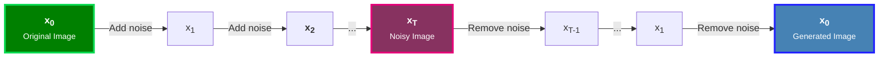
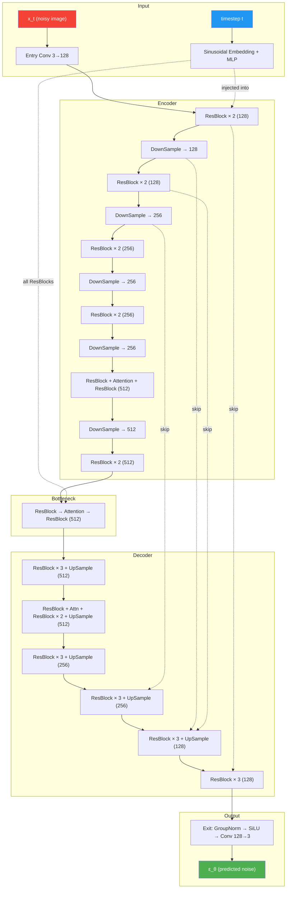

# Denoising Diffusion Probabilistic Models (*DDPM*)

!!! abstract "Paper Reference"
    **Title:** Denoising Diffusion Probabilistic Models  
    **Authors:** Jonathan Ho, Ajay Jain, Pieter Abbeel  
    **Year:** 2020  
    **Link:** [arXiv:2006.11239](https://arxiv.org/abs/2006.11239) — [Local PDF](../assets/papers/DDPM.pdf)

---

## 1. Overview & Motivation

Diffusion models belong to the family of **likelihood-based generative models**. Unlike Generative Adversarial Networks (*GANs*), which learn through an adversarial approach, or Variational Auto Encoders (*VAEs*), which optimize a variational bound with an explicit encoder, diffusion models take a different approach: they learn to reconstruct data by **undoing noise step by step**.

The core idea consists of two processes:

1. **Forward process**: Starting from a data sample (x<sub>0</sub>), Gaussian Noise is progressively added over T steps until the data distribution is transformed into nearly pure noise.
2. **Reverse process**: A neural network is trained to reverse the forward process, predicting and removing the noise at each step to recover the original data.

<figure markdown = "span", style="width: 800px;">

<figcaption>The forward process (x<sub>0</sub> → x<sub>T</sub>) destroys the image structure, while the reverse process (x<sub>T</sub> → x<sub>0</sub>) creates it.</figcaption>
</figure>

A key property of DDPMs is that the forward process admits a **Closed-form Solution**, allowing us to sample x<sub>t</sub> at any timestep directly without simulating all the previous steps.

This leads to a particularly simple and stable training objective: the model is trained to predict the added noise, using a standard mean squared error (*MSE*) loss between the true injected noise and the predicted noise.

---

## 2. The Forward Diffusion Process

### 2.1 The Markov Chain

The forward process defines a Markov chain that progressively adds Gaussian noise to data \( \mathbf{x}_0 \sim q(\mathbf{x}_0) \) over \( T \) timesteps:

\[
q(\mathbf{x}_t \mid \mathbf{x}_{t-1}) = \mathcal{N}\left(\mathbf{x}_t;\ \sqrt{1 - \beta_t}\,\mathbf{x}_{t-1},\ \beta_t \mathbf{I}\right)
\]

where \( \beta_t \in (0, 1) \) is the **variance schedule** — a small value that controls how much noise is added at each step. In DDPM, this is a **linear schedule** from \( \beta_1 = 10^{-4} \) to \( \beta_T = 0.02 \).

!!! info "Intuition"
    At each step, the sample is *slightly* shrunk (multiplied by \( \sqrt{1 - \beta_t} < 1 \)) and then perturbed with Gaussian noise of variance \( \beta_t \). After enough steps, the signal is completely drowned in noise.

??? example "→ Code: Linear Noise Schedule"
    The linear schedule is implemented in [`models/base/noiseSchedule.py`](https://github.com/FabioS08/In_The_Beginning_Was_Noise/blob/main/models/base/noiseSchedule.py):

    ```python
    class LinearSchedule(NoiseSchedule):

        def __init__(self, betaStart: float = 1e-4, betaEnd: float = 0.02):
            self.betaStart = betaStart
            self.betaEnd = betaEnd

        def __call__(self, T: int) -> torch.Tensor:
            return torch.linspace(self.betaStart, self.betaEnd, T)
    ```

### 2.2 The Nice Property: Closed-Form Sampling

A key insight is that we don't need to iterate through all \( t \) steps to get \( \mathbf{x}_t \). Define:

\[
\alpha_t = 1 - \beta_t \qquad\qquad \bar{\alpha}_t = \prod_{s=1}^{t} \alpha_s
\]

Then, by recursively applying the Gaussian addition and using the fact that the sum of Gaussians is Gaussian, we get the **closed-form** expression:

\[
\boxed{q(\mathbf{x}_t \mid \mathbf{x}_0) = \mathcal{N}\left(\mathbf{x}_t;\ \sqrt{\bar{\alpha}_t}\,\mathbf{x}_0,\ (1 - \bar{\alpha}_t)\,\mathbf{I}\right)}
\]

This means we can sample \( \mathbf{x}_t \) at **any** timestep directly using the **reparameterization trick**:

\[
\mathbf{x}_t = \sqrt{\bar{\alpha}_t}\,\mathbf{x}_0 + \sqrt{1 - \bar{\alpha}_t}\,\boldsymbol{\epsilon} \qquad\text{where } \boldsymbol{\epsilon} \sim \mathcal{N}(\mathbf{0}, \mathbf{I})
\]

!!! info "Intuition"
    - \( \sqrt{\bar{\alpha}_t} \) is the **signal coefficient** — it scales down the original image
    - \( \sqrt{1 - \bar{\alpha}_t} \) is the **noise coefficient** — it scales up the noise
    - As \( t \to T \), \( \bar{\alpha}_t \to 0 \): the signal vanishes and only noise remains

??? example "→ Code: Coefficient Registration"
    These coefficients are precomputed in [`models/base/diffusion.py`](https://github.com/FabioS08/In_The_Beginning_Was_Noise/blob/main/models/base/diffusion.py) inside `BaseDiffusion._registerCoefficients()`:

    ```python
    # Forward Process Coefficients
    self.register_buffer('betas', betas)
    self.register_buffer('alphas', 1.0 - betas)
    self.register_buffer('cumulativeAlphas', torch.cumprod(self.alphas, dim=0))
    self.register_buffer('signalCoefficients', torch.sqrt(self.cumulativeAlphas))      # √ᾱₜ
    self.register_buffer('noiseCoefficients', torch.sqrt(1 - self.cumulativeAlphas))   # √(1-ᾱₜ)
    ```

    And the closed-form sampling is used in the forward pass of [`models/ddpm/ddpm.py`](https://github.com/FabioS08/In_The_Beginning_Was_Noise/blob/main/models/ddpm/ddpm.py):

    ```python
    # Compute the noisy images at time t through the closed-form approach
    noisyImages = self.signalCoefficients[t].view(-1,1,1,1) * x \
                + self.noiseCoefficients[t].view(-1,1,1,1) * noise
    ```

---

## 3. The Reverse Process

### 3.1 Learning to Denoise

The reverse process is also defined as a Markov chain, but it runs **backwards** in time. Since we don't know the true reverse distribution \( q(\mathbf{x}_{t-1} \mid \mathbf{x}_t) \), we approximate it with a learned Gaussian:

\[
p_\theta(\mathbf{x}_{t-1} \mid \mathbf{x}_t) = \mathcal{N}\left(\mathbf{x}_{t-1};\ \boldsymbol{\mu}_\theta(\mathbf{x}_t, t),\ \sigma_t^2 \mathbf{I}\right)
\]

The neural network (a U-Net, parameterized by \( \theta \)) must learn the **mean** \( \boldsymbol{\mu}_\theta \). The variance \( \sigma_t^2 \) is kept fixed in DDPM[^1].

[^1]: Ho et al. fix \( \sigma_t^2 = \beta_t \) (or equivalently \( \tilde{\beta}_t \)). Later works like *Improved DDPM* (Nichol & Dhariwal, 2021) also learn the variance.

### 3.2 What Does the Network Actually Predict?

A critical design choice in DDPM is that instead of directly predicting \( \boldsymbol{\mu}_\theta \), the network predicts the **noise** \( \boldsymbol{\epsilon}_\theta(\mathbf{x}_t, t) \) that was added to create \( \mathbf{x}_t \).

Given the closed-form expression \( \mathbf{x}_t = \sqrt{\bar{\alpha}_t}\,\mathbf{x}_0 + \sqrt{1 - \bar{\alpha}_t}\,\boldsymbol{\epsilon} \), we can express the mean as:

\[
\boldsymbol{\mu}_\theta(\mathbf{x}_t, t) = \frac{1}{\sqrt{\alpha_t}} \left( \mathbf{x}_t - \frac{1 - \alpha_t}{\sqrt{1 - \bar{\alpha}_t}} \boldsymbol{\epsilon}_\theta(\mathbf{x}_t, t) \right)
\]

!!! info "Intuition"
    Instead of asking the network *"what does the clean image look like?"*, we ask *"what noise was added?"*. This is equivalent but works much better in practice because the noise has a known, well-behaved distribution.

??? example "→ Code: Reverse Coefficients"
    The coefficients for computing the mean are precomputed in [`models/base/diffusion.py`](https://github.com/FabioS08/In_The_Beginning_Was_Noise/blob/main/models/base/diffusion.py):

    ```python
    # Reverse Process Coefficients
    self.register_buffer('reciprocalSQRTAlphas',                              # 1/√αₜ 
                         torch.sqrt(1 / self.alphas))
    self.register_buffer('reverseNoiseCoefficient',                            # (1-αₜ)/√(1-ᾱₜ)
                         (1 - self.alphas) * torch.sqrt(1 / (1 - self.cumulativeAlphas)))
    ```

### 3.3 Posterior Variance

For the variance of the reverse steps, DDPM uses the **posterior variance** derived from Bayes' theorem:

\[
\tilde{\beta}_t = \frac{1 - \bar{\alpha}_{t-1}}{1 - \bar{\alpha}_t} \cdot \beta_t
\]

??? example "→ Code: Posterior Variance"
    ```python
    cumulativeAlphasPrev = F.pad(self.cumulativeAlphas[:-1], (1, 0), value=1.0)
    self.register_buffer('posteriorVariance', 
        self.betas * (1 - cumulativeAlphasPrev) / (1 - self.cumulativeAlphas))
    ```

    Note the `F.pad(..., value=1.0)`: this defines \( \bar{\alpha}_0 = 1 \), which makes mathematical sense since at \( t=0 \) there is no noise.

---

## 4. Training Objective

### 4.1 From ELBO to Simple Loss

The standard approach for training likelihood-based models is to maximize the **Evidence Lower Bound (ELBO)**. For diffusion models, the negative ELBO decomposes into:

\[
L = \underbrace{D_\text{KL}\big(q(\mathbf{x}_T \mid \mathbf{x}_0) \,\|\, p(\mathbf{x}_T)\big)}_{L_T\ (\text{constant})} + \sum_{t=2}^{T} \underbrace{D_\text{KL}\big(q(\mathbf{x}_{t-1} \mid \mathbf{x}_t, \mathbf{x}_0) \,\|\, p_\theta(\mathbf{x}_{t-1} \mid \mathbf{x}_t)\big)}_{L_{t-1}} + \underbrace{\left(-\log p_\theta(\mathbf{x}_0 \mid \mathbf{x}_1)\right)}_{L_0}
\]

- **\( L_T \)**: Constant — doesn't depend on \( \theta \)
- **\( L_{t-1} \)**: KL divergence between two Gaussians — measures how well the model approximates the true reverse step
- **\( L_0 \)**: Reconstruction term

### 4.2 The Simplified Objective

Ho et al. showed that the KL terms \( L_{t-1} \), when parameterized in terms of noise prediction, reduce to:

\[
L_{t-1} \propto \left\| \boldsymbol{\epsilon} - \boldsymbol{\epsilon}_\theta\!\left(\sqrt{\bar{\alpha}_t}\,\mathbf{x}_0 + \sqrt{1 - \bar{\alpha}_t}\,\boldsymbol{\epsilon},\ t\right) \right\|^2
\]

And the final **simplified training objective** drops the weighting terms entirely:

\[
\boxed{L_\text{simple} = \mathbb{E}_{t,\,\mathbf{x}_0,\,\boldsymbol{\epsilon}}\left[\left\| \boldsymbol{\epsilon} - \boldsymbol{\epsilon}_\theta(\mathbf{x}_t, t) \right\|^2\right]}
\]

!!! info "Intuition"
    The training loss is simply the **mean squared error** between:
    
    - The actual noise \( \boldsymbol{\epsilon} \) that was sampled and added to the image
    - The noise \( \boldsymbol{\epsilon}_\theta(\mathbf{x}_t, t) \) that the U-Net predicted
    
    The network learns to "see through" the noise at every corruption level.

??? example "→ Code: Forward Pass (Training)"
    The forward pass in [`models/ddpm/ddpm.py`](https://github.com/FabioS08/In_The_Beginning_Was_Noise/blob/main/models/ddpm/ddpm.py) implements exactly this:

    ```python
    def forward(self, x: torch.Tensor):
        # Sample a random timestep for each image in the batch
        t = torch.randint(0, self.T, (x.shape[0], ), device=x.device)
        noise = torch.randn(x.shape, device=x.device)                  # ε ~ N(0, I)

        # Compute x_t via the closed-form: √ᾱₜ·x₀ + √(1-ᾱₜ)·ε
        noisyImages = self.signalCoefficients[t].view(-1,1,1,1) * x \
                    + self.noiseCoefficients[t].view(-1,1,1,1) * noise

        return (noise, self.unet(noisyImages, t))  # (target, prediction)
    ```

    The MSE loss is then computed externally:
    ```python
    target, prediction = self.model(batch)
    loss = self.lossFunction(prediction, target)   # nn.MSELoss()
    ```

---

## 5. Sampling (Inference)

### 5.1 The Algorithm

Once trained, generating new images means running the reverse process. Starting from pure Gaussian noise \( \mathbf{x}_T \sim \mathcal{N}(\mathbf{0}, \mathbf{I}) \), we iteratively denoise:

!!! note "Algorithm 2: Sampling"

    **Input**: Trained model \( \boldsymbol{\epsilon}_\theta \), number of steps \( T \)  

    1. Sample \( \mathbf{x}_T \sim \mathcal{N}(\mathbf{0}, \mathbf{I}) \)
    2. **for** \( t = T, T-1, \ldots, 1 \) **do**:
        1. Sample \( \mathbf{z} \sim \mathcal{N}(\mathbf{0}, \mathbf{I}) \) if \( t > 1 \), else \( \mathbf{z} = \mathbf{0} \)
        2. Compute the predicted mean: 
        \[
        \boldsymbol{\mu}_t = \frac{1}{\sqrt{\alpha_t}} \left( \mathbf{x}_t - \frac{1 - \alpha_t}{\sqrt{1 - \bar{\alpha}_t}} \boldsymbol{\epsilon}_\theta(\mathbf{x}_t, t) \right)
        \]
        3. Update: \( \mathbf{x}_{t-1} = \boldsymbol{\mu}_t + \sqrt{\tilde{\beta}_t}\,\mathbf{z} \)
    3. **return** \( \mathbf{x}_0 \)

!!! warning "No noise at t = 0"
    At the very last step (\( t = 1 \to 0 \)), we set \( \mathbf{z} = \mathbf{0} \) because adding noise at this point would corrupt the final output.

??? example "→ Code: Sampling Loop"
    The sampling loop in [`models/ddpm/ddpm.py`](https://github.com/FabioS08/In_The_Beginning_Was_Noise/blob/main/models/ddpm/ddpm.py):

    ```python
    @torch.no_grad()
    def sample(self, batchSize, imageSize, device):
        # 1. Start from pure noise
        x = torch.randn((batchSize, 3, imageSize, imageSize), device=device)

        # 2. Iteratively denoise from T to 0
        for t in reversed(range(self.T)):
            # Predict the noise component
            noiseComponent = self.unet(x, torch.full((batchSize,), t, device=device))

            # Compute the mean: (1/√αₜ) · (xₜ - ((1-αₜ)/√(1-ᾱₜ)) · ε_θ)
            mean = self.reciprocalSQRTAlphas[t].view(-1,1,1,1) * \
                   (x - self.reverseNoiseCoefficient[t].view(-1,1,1,1) * noiseComponent)

            # Sample noise (zero at last step)
            if t > 0:
                noise = torch.randn(x.shape, device=device)
            else:
                noise = torch.zeros(x.shape, device=device)

            # x_{t-1} = μ_t + √β̃ₜ · z
            x = mean + torch.sqrt(self.posteriorVariance[t]) * noise

        return x
    ```

---

## 6. The Noise Schedule

The **variance schedule** \( \{\beta_t\}_{t=1}^{T} \) controls the diffusion dynamics. DDPM uses a **linear schedule**:

\[
\beta_t = \beta_1 + \frac{t - 1}{T - 1}(\beta_T - \beta_1) \qquad \text{with } \beta_1 = 10^{-4},\ \beta_T = 0.02
\]

| Property | Effect of larger \( \beta_t \) | Effect of smaller \( \beta_t \) |
|:---------|:-------------------------------|:--------------------------------|
| Per-step noise | More noise added per step | Less noise added per step |
| Signal decay | \( \bar{\alpha}_t \) decays faster | \( \bar{\alpha}_t \) decays slower |
| Required steps | Fewer steps to reach noise | More steps needed |
| Generation quality | May lose fine details | Better quality but slower |

!!! info "Why Linear?"
    The linear schedule is the simplest choice and works well with \( T = 1000 \) steps. Later works (e.g., *Improved DDPM*) introduced cosine schedules that preserve more signal in early timesteps, improving sample quality especially for low-resolution images.

---

## 7. Architecture: The U-Net

DDPM uses a **U-Net** architecture as the noise prediction backbone \( \boldsymbol{\epsilon}_\theta \). The U-Net takes a noisy image \( \mathbf{x}_t \) and the timestep \( t \) as input, and produces a noise prediction of the same spatial dimensions.

### 7.1 Key Design Choices

| Component | Description | Purpose |
|:----------|:------------|:--------|
| **Sinusoidal Embedding** | Maps scalar timestep \( t \) to a high-dimensional vector | Tells the network *how noisy* the input is |
| **ResBlocks** | Convolutional blocks with GroupNorm, SiLU, and skip connections | Core feature extraction with timestep conditioning |
| **Self-Attention** | Applied at 16×16 resolution | Captures long-range spatial dependencies |
| **Skip Connections** | Encoder features concatenated with decoder features | Preserves fine-grained spatial information |

### 7.2 Timestep Conditioning

The timestep is embedded using **sinusoidal positional encoding** (borrowed from Transformers) followed by an MLP:

\[
\text{PE}(t, 2i) = \sin\!\left(\frac{t}{10000^{2i/d}}\right) \qquad \text{PE}(t, 2i+1) = \cos\!\left(\frac{t}{10000^{2i/d}}\right)
\]

This embedding is then projected and **added** inside each ResBlock between the two convolutional layers, allowing the network to modulate its behavior based on the noise level.

### 7.3 Architecture Diagram



!!! tip "For the full architecture specification"
    See the [U-Net Architecture](../architecture/unet.md) page for a detailed breakdown of each block type and the configuration system.

---

## 8. Putting It All Together

### Training Algorithm

!!! note "Algorithm 1: Training"
    1. **repeat**
    2. &emsp; Sample \( \mathbf{x}_0 \sim q(\mathbf{x}_0) \) &emsp;*(a batch of clean images)*
    3. &emsp; Sample \( t \sim \text{Uniform}(\{1, \ldots, T\}) \)
    4. &emsp; Sample \( \boldsymbol{\epsilon} \sim \mathcal{N}(\mathbf{0}, \mathbf{I}) \)
    5. &emsp; Take a gradient descent step on: \( \nabla_\theta \left\| \boldsymbol{\epsilon} - \boldsymbol{\epsilon}_\theta\!\left(\sqrt{\bar{\alpha}_t}\,\mathbf{x}_0 + \sqrt{1 - \bar{\alpha}_t}\,\boldsymbol{\epsilon},\ t\right) \right\|^2 \)
    6. **until** converged

### Summary of Key Equations

| Equation | Formula | Code Variable |
|:---------|:--------|:--------------|
| Forward noise | \( \mathbf{x}_t = \sqrt{\bar{\alpha}_t}\,\mathbf{x}_0 + \sqrt{1-\bar{\alpha}_t}\,\boldsymbol{\epsilon} \) | `signalCoefficients`, `noiseCoefficients` |
| Reverse mean | \( \boldsymbol{\mu}_t = \frac{1}{\sqrt{\alpha_t}}\left(\mathbf{x}_t - \frac{1-\alpha_t}{\sqrt{1-\bar{\alpha}_t}}\boldsymbol{\epsilon}_\theta\right) \) | `reciprocalSQRTAlphas`, `reverseNoiseCoefficient` |
| Posterior variance | \( \tilde{\beta}_t = \frac{(1-\bar{\alpha}_{t-1})}{(1-\bar{\alpha}_t)}\beta_t \) | `posteriorVariance` |
| Training loss | \( \|\boldsymbol{\epsilon} - \boldsymbol{\epsilon}_\theta(\mathbf{x}_t, t)\|^2 \) | `nn.MSELoss` |

---

## 9. Hyperparameters Used

The default configuration in this repository ([`configs/ddpm_celebahq.py`](https://github.com/FabioS08/In_The_Beginning_Was_Noise/blob/main/configs/ddpm_celebahq.py)):

| Parameter | Value | Notes |
|:----------|:------|:------|
| \( T \) | 1000 | Number of diffusion timesteps |
| \( \beta_1 \) | \( 10^{-4} \) | Start of linear schedule |
| \( \beta_T \) | 0.02 | End of linear schedule |
| Embedding dim | 128 | Sinusoidal timestep embedding dimension |
| Optimizer | AdamW | Learning rate \( 10^{-4} \) |
| Loss | MSE | As derived from the simplified objective |
| Dataset | CelebA-HQ | 256×256 face images |
| Channels | 128 → 128 → 256 → 256 → 512 → 512 | Progressive channel expansion |
| Attention | At 16×16 resolution | Single-head self-attention |

---

## 10. Further Reading

- **Improved DDPM** (Nichol & Dhariwal, 2021): Learns the variance \( \sigma_t^2 \) and uses a cosine schedule
- **DDIM** (Song et al., 2020): Non-Markovian sampling that allows fewer steps
- **Score-Based Models** (Song & Ermon, 2019): The score matching perspective on diffusion
- **Latent Diffusion** (Rombach et al., 2022): Runs diffusion in a compressed latent space (Stable Diffusion)
